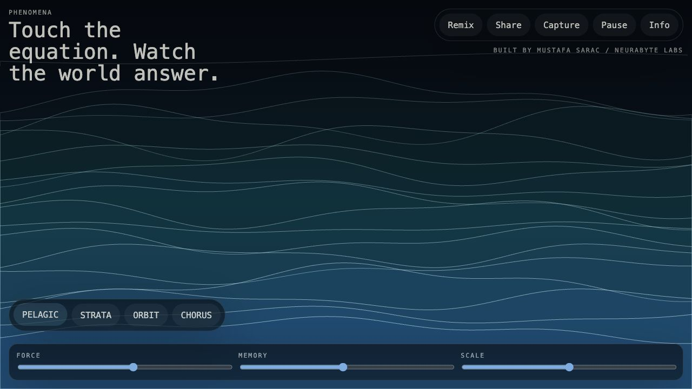
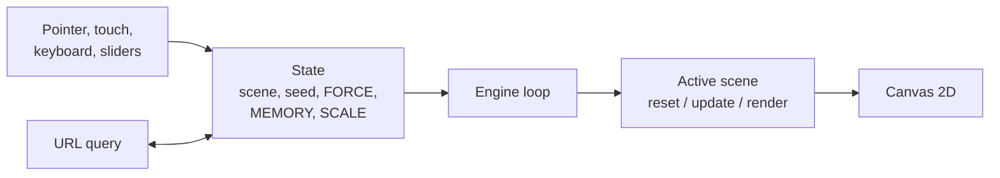

# PHENOMENA

Four small simulations of natural systems on one canvas that you can push, remix and share as a link.

[](LICENSE)

**Live demo:** [phenomena.mustafasarac.com](https://phenomena.mustafasarac.com/)



## Why

Each scene is driven by a short equation, and you can feel what it does by touching it instead of reading it. Every scene uses the same three controls and the same gestures, so moving between them is a comparison, not a new interface to learn. The whole state fits in the URL, so any moment can be shared as a link.

| Scene | What it shows | Equation shown in the info panel |
|---|---|---|
| `PELAGIC` | Contour currents drift in stacked bands that bow around your touch and settle with inertia. | `h(x,t)=sin(ax+pt)+sin(bx-qt)+J(pointer, memory)` |
| `STRATA` | Compressed layers bend into pressure ridges, then crack outward in short fracture rings. | `z(x,t)=ridge(x)+fault(x,t)+P(hold)-R(release)` |
| `ORBIT` | A small gravity field draws persistent trail structures that bend around a temporary attractor. | `ẍ = Σ Gm(r)/(r²+ε²)^(3/2), τtrail = f(MEMORY)` |
| `CHORUS` | A harmonic lattice braids phase relationships into a visual chorus, without any audio. | `x=sin(a·μ(M)t+κ·pointer+φ), y=sin(b·μ(M)t+φ)·A(coupling)` |

## Quick start

You need Node.js 22 (the version CI uses).

```bash
git clone https://github.com/neurabytelabs/phenomena.git
cd phenomena
npm install
npm run dev
```

Checks (the same steps CI runs):

```bash
npm run typecheck
npm test -- --run   # Vitest unit tests
npm run build
npm run verify      # checks dist/ and the source: metadata, assets, forbidden APIs, JS bundle under 250 KB
```

## Usage

- **Pointer / touch:** perturb the field.
- **Hold:** accumulate force. **Release:** let the system settle.
- **Keyboard:** `1`–`4` switch scenes, `R` remix (new seed), `Space` pause, `I` info, `Esc` close info.
- **Parameters:** `FORCE`, `MEMORY`, `SCALE`, each clamped to a fixed range.
- **Share** copies a link with the scene, seed and parameters. **Capture** saves the canvas as a PNG.

## How it works

PHENOMENA is a static Vite + TypeScript site with no runtime dependencies. Everything is drawn with the Canvas 2D API.



- **Engine** ([`src/core/engine.ts`](src/core/engine.ts)) caps the device pixel ratio and picks a particle/line density from the viewport size, pointer type and reduced-motion setting.
- **Scenes** ([`src/scenes/`](src/scenes/)) each implement one `Phenomenon` interface (`reset`, `update`, `render`) from [`src/core/types.ts`](src/core/types.ts).
- **State** ([`src/core/state.ts`](src/core/state.ts)) is clamped and serialized to the URL query, and a seeded PRNG ([`src/core/random.ts`](src/core/random.ts)) makes the same link produce the same starting scene.
- **Deployment:** the [`Dockerfile`](Dockerfile) builds and verifies the site, then serves `dist/` with nginx. [`nginx.conf`](nginx.conf) adds a SPA fallback, a strict Content Security Policy, a `Permissions-Policy` that blocks camera, microphone and geolocation, and long-lived caching for hashed assets.

The product design notes are in [`docs/specs/2026-08-18-phenomena-design.md`](docs/specs/2026-08-18-phenomena-design.md).

## Status / limits

Release 1 (package version 0.1.0, no tagged release yet).

- Four scenes only; there is no editor and no way to add your own equations from the UI.
- The simulations are visual approximations, not physically accurate models.
- Unit tests cover the pure logic (math, physics helpers, PRNG, state, scene parameters, a smoke test). Rendering and interaction have no automated tests.
- `npm run verify` only checks the build output and source rules; it does not run the app in a browser.
- By design there is no backend, analytics, accounts, camera, microphone or audio.
- Needs a browser with Canvas 2D; there is a plain fallback message when the canvas is not available.

## License

MIT. See [LICENSE](LICENSE). © 2026 Mustafa Saraç / NeuraByte Labs.
